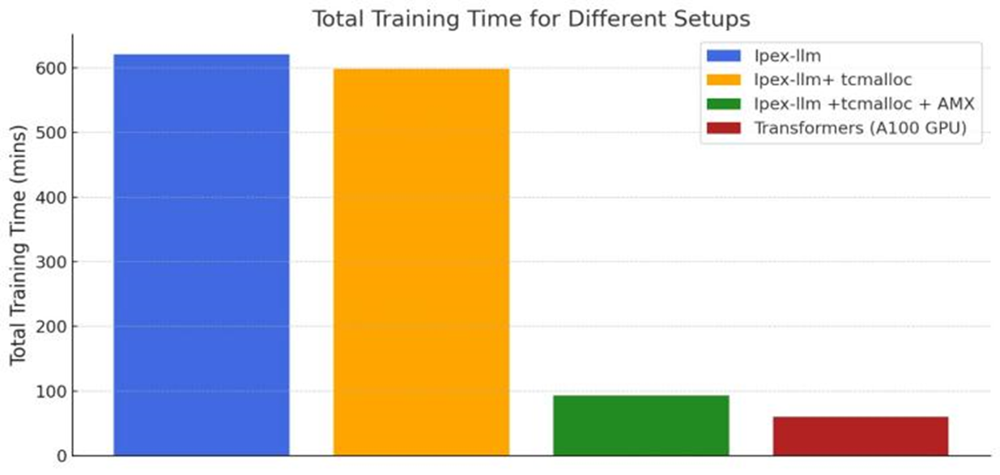

# CPUs as a Viable Alternative to GPUs for Parameter-Efficient Fine-Tuning in Medical Summarization

_As a Medical ML Engineer at Qmed Asia, we are always looking for opportunities to deploy practical and useful ML technologies in clinical settings. In this article, I introduce three key technologies that help us speed up fine-tuning Llama 3 8B on the 4th Gen Intel® Xeon® Scalable Processor (6443) by 6-7x, thus approaching the training time of an NVIDIA A100 GPU._

## The High Cost of GPUs vs. Practicality of CPUs

https://www.amazon.com/NVIDIA-Ampere-Graphics-Processor-Accelerator/dp/B08X13X6HF

Consider the costs: a single **NVIDIA Tesla A100 GPU**, a popular choice for fine-tuning, costs around [**$8,300**](https://www.amazon.com/NVIDIA-Ampere-Graphics-Processor-Accelerator/dp/B08X13X6HF). In contrast, a high-performance CPU like the **Intel Xeon 6443** can be purchased for roughly [**$3,250**](https://www.intel.com/content/www/us/en/products/sku/236593/intel-xeon-gold-6443n-processor-60m-cache-1-90-ghz/specifications.html), less than half the price. Moreover, GPUs often sit idle once the fine-tuning process is complete due to the infrequent cadence and shorter duration of fine-tuning compared to training a model from scratch.

By using CPUs not only for inference but also for fine-tuning, healthcare organizations can achieve:

- **Substantial cost savings**
- **Better resource utilization**
- **Reduced energy consumption**

This makes CPU-based fine-tuning a more sustainable approach for clinical applications.

## Methodology: Three Key Steps to Unlocking CPU Fine-Tuning Efficiency

To evaluate the viability of CPUs, we used several innovative CPU optimization techniques. Below, we describe each step that contributed to our results.

### 1. Intel Extension for PyTorch (IPEX-LLM)

IPEX-LLM extends PyTorch’s capabilities to run LLMs with low latency on Intel CPUs. It integrates seamlessly with popular frameworks like Hugging Face and LangChain and optimizes the critical General Matrix Multiply (GEMM) operations, which are essential for deep learning workloads. 

#### Key Features of IPEX-LLM:
- Supports low-bit quantization (INT4, FP4, INT8, FP8), reducing the memory footprint of models.
- Provides optimized implementations of matrix multiplication to make efficient use of Intel’s hardware.

[More information on IPEX-LLM](https://github.com/intel-analytics/ipex-llm)

### 2. Intel® Advanced Matrix Extensions (AMX)

AMX is a hardware-accelerated matrix computation feature in Intel Xeon processors that can multiply large matrices in one step. AMX introduces two main components that significantly improve processing speed:

- **Tiles**: Eight 2D registers, each with 1KB of storage, allow AMX to store more data in each core, minimizing data movement between cache and cores and improving latency.
- **Tile Matrix Multiplication (TMUL)**: This feature enables AMX to process larger matrices in a single operation, optimizing LLM fine-tuning workloads.

> **Performance Gain:** With AMX, our trials showed a 6-7x speed increase in fine-tuning time compared to runs without AMX, bringing CPU performance remarkably close to that of the A100 GPU.

### 3. Google’s TCMalloc

In any deep learning task, memory management can be a bottleneck, especially when working with large models. To address this, we employed TCMalloc, a high-performance memory manager from Google, which:

- Caches frequently accessed objects, minimizing memory allocation overhead during fine-tuning.
- Enhances memory efficiency, allowing our Llama 3 8B Instruct model to maintain consistent performance while consuming less memory.

## Results: Comparable Performance with Enhanced Practicality

Our results validate the efficacy of this CPU-based approach. With Intel Xeon 6443 CPUs and AMX acceleration, we achieved fine-tuning times comparable to that of the NVIDIA A100 GPU. 

.png>)

Despite the switch to CPU-only fine-tuning, **summarization quality remained consistent**, as demonstrated by accuracy metrics comparable to GPU-based methods.

---

### Key Takeaways

- **Cost-Efficiency**: CPU-based fine-tuning on Intel Xeon processors costs significantly less than using high-end GPUs, translating to immediate savings for institutions that need frequent model adjustments.
- **Privacy-Conscious**: CPU-only fine-tuning allows on-premises deployment, alleviating concerns about patient data privacy when working with sensitive clinical data.
- **Resource Utilization**: By eliminating idle GPU time, healthcare organizations can more effectively allocate resources for other critical tasks.

---

### Conclusion

This study shows that CPUs, enhanced with tools like IPEX-LLM, AMX, and TCMalloc, are not only viable but advantageous for fine-tuning large models in clinical summarization. For organizations in healthcare and beyond, embracing CPUs for LLM fine-tuning presents a **cost-effective, privacy-conscious, and resource-efficient alternative** to traditional GPU-centric approaches. As CPU technology advances, we anticipate even greater capabilities, making this an essential area of focus for ML engineers and data scientists looking to optimize performance and reduce costs in medical AI.